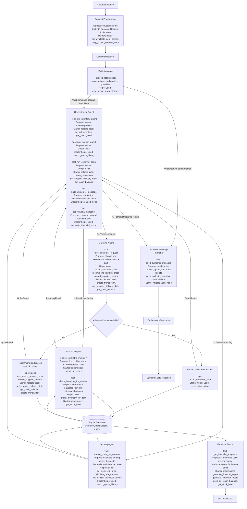

```mermaid
flowchart TD
    A[Customer inquiry] --> B[Request Parser Agent<br/><br/>Purpose: convert customer text into CustomerRequest<br/>Tools: none<br/>Helpers used: get_available_item_names,<br/>keep_known_request_items]
    B --> C[CustomerRequest]
    C --> D[Validation gate<br/><br/>Purpose: retain exact catalog items and positive quantities<br/>Helper used: keep_known_request_items]
    D -->|Valid items and positive quantities| E[Orchestration Agent<br/><br/>Tool: run_inventory_agent<br/>Purpose: obtain InventoryResult<br/>Starter helpers used: get_all_inventory, get_stock_level<br/><br/>Tool: run_quoting_agent<br/>Purpose: obtain QuoteResult<br/>Starter helper used: search_quote_history<br/><br/>Tool: run_ordering_agent<br/>Purpose: obtain OrderResult<br/>Starter helpers used: create_transaction,<br/>get_supplier_delivery_date, get_cash_balance<br/><br/>Tool: build_customer_message<br/>Purpose: create the customer-safe response<br/>Starter helpers used: none<br/><br/>Tool: get_financial_snapshot<br/>Purpose: create an internal audit snapshot<br/>Starter helper used: generate_financial_report]
    D -->|Unsupported items retained| M[Customer Message Formatter<br/><br/>Tool: build_customer_message<br/>Purpose: combine the request, quote, and order results<br/>while excluding sensitive internal data<br/>Starter helpers used: none]

    E -->|1. Check availability| F[Inventory Agent<br/><br/>Tool: list_available_inventory<br/>Purpose: list positive stock on the requested date<br/>Starter helper used: get_all_inventory<br/><br/>Tool: check_inventory_for_request<br/>Purpose: check each requested item and calculate shortages<br/>Helper used: check_inventory_for_item<br/>Starter helper used: get_stock_level]
    F --> G[(SQLite Database<br/>inventory, transactions, quotes)]
    G --> F
    F -->|InventoryResult| E

    E -->|2. Generate pricing| H[Quoting Agent<br/><br/>Tool: create_quote_for_request<br/>Purpose: calculate catalog prices, discounts,<br/>line totals, and the total quote<br/>Helpers used: get_item_unit_price,<br/>calculate_bulk_discount,<br/>find_similar_historical_quotes<br/>Starter helper used: search_quote_history]
    H --> G
    G --> H
    H -->|QuoteResult| E

    E -->|3. Process request| I[Ordering Agent<br/><br/>Tool: fulfill_customer_request<br/>Purpose: choose and execute the sale or restock path<br/>Helpers used: record_customer_sale,<br/>recommend_restock_order, record_supplier_restock<br/>Starter helpers used: create_transaction,<br/>get_supplier_delivery_date, get_cash_balance]
    I --> J{All quoted items available?}
    J -->|Yes| K[Record sales transactions<br/><br/>Helper: record_customer_sale<br/>Starter helper used: create_transaction]
    J -->|No| L[Recommend and record restock orders<br/><br/>Helpers used: recommend_restock_order,<br/>record_supplier_restock<br/>Starter helpers used: get_supplier_delivery_date,<br/>get_cash_balance, create_transaction]
    K --> G
    L --> G
    K -->|OrderResult| E
    L -->|OrderResult| E

    E -->|4. Format structured results| M
    M --> N[OrchestratorResponse]
    N --> O[Customer-safe response]

    G --> P[Financial Report<br/><br/>Tool: get_financial_snapshot<br/>Purpose: summarize cash, inventory value,<br/>and total assets for internal audit<br/>Starter helper used: generate_financial_report<br/>generate_financial_report uses: get_cash_balance,<br/>get_stock_level]
    P --> Q[test_results.csv]
```
